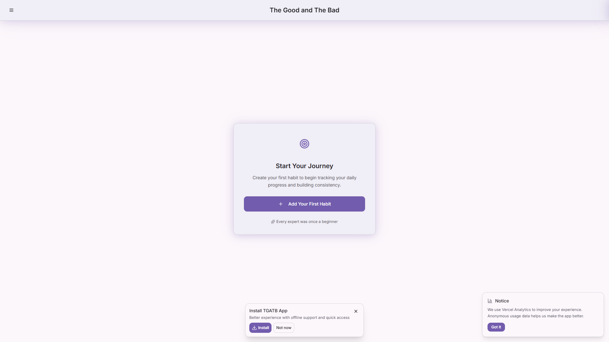

# The Good and The Bad: Habit Tracker

[](https://github.com/adsurkasur/tgatb-habit-tracker/actions)
[](LICENSE)
[](https://tgatb.vercel.app/)

**Track your habits simply. Focus on what matters. Now available as a PWA and Android app!**

---

## Demo

Try it live: [tgatb.vercel.app](https://tgatb.vercel.app/)

---

## Screenshots



---

## Features

### Core

- 📱 Mobile-first, responsive design
- 🎨 Modern UI with clean aesthetics (Shadcn/ui, Radix UI, Tailwind CSS)
- ⚡ Real-time updates and optimistic UI (TanStack Query)
- 📊 Progress tracking with visual indicators
- 🔄 Habit streaks and consistency metrics
- 💾 Local, private data persistence
- ⚙️ Next.js App Router with server components
- 🌐 Offline-first experience (Service Worker, custom caching)
- 📦 Installable as a PWA (Progressive Web App) on desktop and mobile
- 🤖 Android app build via Capacitor (see [ANDROID_SETUP.md](docs/ANDROID_SETUP.md))
- 🔔 Push notifications (browser and Android)
- 🧩 Modular hooks and utilities for habits, PWA, offline, and status bar

### Technical

- Built with **TypeScript** and strict mode
- ESLint and Prettier for code quality
- Vercel deployment optimized
- Capacitor integration for native features (Android/iOS)
- Custom service worker for offline and background sync
- Shadcn/ui, Radix UI, Tailwind CSS for UI
- TanStack Query for state management

### Roadmap / Upcoming

- 🗄️ Cloud sync and backup
- 👤 User authentication and multi-device support
- 📅 Calendar view and advanced analytics
- 🛠️ Customizable habit categories and reminders
- 🌙 Dark mode toggle
- More notification and motivational features

---

## Why Minimalist?

TGATB Habit Tracker is designed for users who want a distraction-free, fast, and reliable way to track habits. No sign-up required, no ads, no clutter—just your habits.

---

## Tech Stack

- **Framework:** Next.js 15 (App Router)
- **Language:** TypeScript
- **UI:** Shadcn/ui, Radix UI, Tailwind CSS
- **State Management:** TanStack Query
- **Storage:** Platform-aware settings and data layer using LocalStorage (web) and Capacitor Preferences (native), plus Service Worker cache
- **Native:** Capacitor (Android/iOS)
- **Deployment:** Vercel (Web), Android Studio (Native)

---

## Getting Started

### Prerequisites

- Node.js 20+
- npm or yarn
- For Android: Java JDK 21, Android Studio (see [ANDROID_SETUP.md](docs/ANDROID_SETUP.md))

### Installation

```bash
git clone https://github.com/adsurkasur/tgatb-habit-tracker.git
cd tgatb-habit-tracker
npm install
```

### Running Locally (Web)

```bash
npm run dev
```

Open [http://localhost:3000](http://localhost:3000) in your browser.

### Building for Android

See [docs/ANDROID_SETUP.md](docs/ANDROID_SETUP.md) for full instructions.

Quick steps:

```powershell
npm run setup:android   # Check prerequisites
npm run android:build   # Build Android APK
npm run android:open    # Open in Android Studio
```

---

## Available Scripts

- `npm run dev` — Start Next.js development server
- `npm run build` — Build for production
- `npm run start` — Start production server
- `npm run lint` — Run ESLint for code quality
- `npm run check` — Run TypeScript type checking
- `npm run setup:android` — Check Android prerequisites
- `npm run android:build` — Build Android APK
- `npm run android:open` — Open project in Android Studio
- `npm run android:run` — Build and run on connected device
- `npm run android:sync` — Sync Capacitor plugins

---

## Project Structure

```text
├── app/                # Next.js App Router pages and layouts
├── components/         # UI components (Button, HabitCard, dialogs, overlays)
├── hooks/              # Custom React hooks (habits, PWA, offline, status bar)
├── lib/                # Utility functions (Capacitor, db, motivator, offline, pwa-utils)
├── public/             # Static assets (icons, images, manifest, service worker)
├── docs/               # Documentation (ANDROID_SETUP.md, etc.)
├── android/            # Native Android project (Capacitor)
├── scripts/            # Project setup and build scripts
├── shared/             # Shared TypeScript types and schema
├── package.json
├── tailwind.config.ts
├── tsconfig.json
└── README.md
```

---

## Storage & Offline

- Web: data and settings stored locally with **LocalStorage**.
- Native (Android): data and settings stored with **Capacitor Preferences**.
- A platform-aware storage layer keeps them in sync so toggles (like fullscreen) persist across web/native.
- Offline support via Service Worker and custom caching (see `public/sw-custom.js`).

---

## Deployment

### Web

This application is optimized for **Vercel deployment**:

1. **Connect Repository:** Import your GitHub repository to Vercel
2. **Deploy:** Vercel automatically builds and deploys with zero configuration
3. **Access:** Your app will be available at [tgatb.vercel.app](https://tgatb.vercel.app/)

The Next.js App Router architecture makes deployment seamless with:

- Static generation for optimal performance
- API routes as serverless functions (if needed)
- Edge runtime support

You can also deploy to other Node.js platforms, but Vercel is recommended.

### Android

See [docs/ANDROID_SETUP.md](docs/ANDROID_SETUP.md) for full instructions.

---

## Development Workflow

1. Make changes to code in `app/` and `components/`
2. TypeScript auto-compiles
3. Next.js hot-reloads frontend

---

## Code Style

- TypeScript strict mode enabled
- ESLint and Prettier recommended
- Clean, modern design principles for UI

---

## Contributing

1. Fork the repository
2. Create a feature branch
3. Make your changes
4. Run type checking: `npm run check`
5. Test your changes
6. Submit a pull request

---

## FAQ

**Q: Is there a mobile app?**  
A: Yes! You can install the PWA on your device, or build/run the native Android app via Capacitor.

**Q: How is my data stored?**  
A: All data is stored locally in your browser or device. No cloud sync yet.

**Q: Can I use this for teams or groups?**  
A: Multi-user support is not implemented yet.

**Q: Does it work offline?**  
A: Yes! Offline support is built-in for both web and Android.

**Q: Are notifications supported?**  
A: Yes! Browser and Android push notifications are supported (where permissions are granted).

---

## License

Apache 2.0 License — see [LICENSE](LICENSE) for details

---

## Support

For issues and questions:

1. Check existing GitHub issues
2. Create a new issue with detailed description
3. Include steps to reproduce any bugs

---

## Community & Feedback

- Star ⭐ the repo if you like it!
- Open an issue for bugs or feature requests
- Join discussions on [GitHub Discussions](https://github.com/adsurkasur/tgatb-habit-tracker/discussions)

---

## Resources

- [Next.js Documentation](https://nextjs.org/docs)
- [Shadcn/ui](https://ui.shadcn.com/)
- [Radix UI](https://www.radix-ui.com/)
- [Tailwind CSS](https://tailwindcss.com/)
- [TanStack Query](https://tanstack.com/query/latest)
- [Capacitor Android Documentation](https://capacitorjs.com/docs/android)
- [Android Developer Guides](https://developer.android.com/guide)
